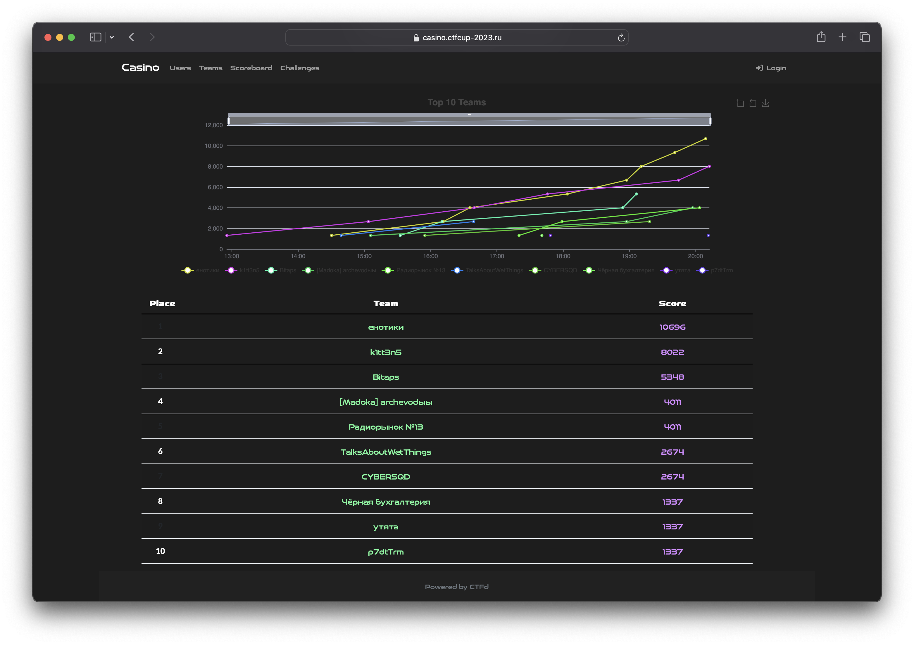

# Финал школьного этапа VII Кубка CTF России

Исходные коды, разборы, сплоиты и файлы для деплоя заданий с финального тура школьного этапа [VII Кубка CTF России](https://ctfcup.ru/), который проходил 8-9 декабря 2023 года. Задания разрабатывала команда [C4T BuT S4D](https://github.com/C4T-BuT-S4D). Финал проходил в формате Casino, представляющим из себя модифицированный task-based, в котором каждая команда в каждый момент времени могла решать только одно задание, случайно выпавшее ей. Для проведения использовался форк платформы CTFd, доработанный [@jnovikov](https://github.com/jnovikov) — [CTFd-casino](https://github.com/jnovikov/CTFd-casino).

- Организаторы: АРСИБ и ВОД «Наставники России»
- Генеральный партнер: RDP
- Официальные партнеры: Сбер и Газпромбанк
- Специальный партнер: Positive Technologies
- Технологические партнеры: EdgeCenter и C4T BuT S4D

# Результаты

# Задания

| Название                                                    | Категория | Автор                                                                             |
| ----------------------------------------------------------- | --------- | --------------------------------------------------------------------------------- |
| [old-cipher](tasks/crp/old-cipher)                          | crypto    | [@falamous](https://github.com/falamous)                                          |
| [secret-message](tasks/crp/secret-message)                  | crypto    | [@falamous](https://github.com/falamous)                                          |
| [jail](tasks/msc/jail)                                      | misc      | [@renbou](https://github.com/renbou)                                              |
| [mikheev-holdings](tasks/msc/mikheev-holdings)              | misc      | [@Slonser](https://github.com/Slonser)                                            |
| [veehkimean-art](tasks/msc/veehkimean-art)                  | misc      | [@qumusabel](https://github.com/qumusabel)                                        |
| [memgame](tasks/pwn/memgame)                               | pwn       | [@user39043346](https://github.com/user39043346)                                  |
| [metra-veehkim](tasks/pwn/metra-veehkim)                    | pwn       | [@user39043346](https://github.com/user39043346)                                  |
| [orders](tasks/pwn/orders)                                  | pwn       | [@user39043346](https://github.com/user39043346)                                  |
| [c4tpixx](tasks/rev/c4tpixx)                                | reverse   | [@qumusabel](https://github.com/qumusabel)                                        |
| [embedded-in-oil](tasks/rev/embedded-in-oil)                | reverse   | [@falamous](https://github.com/falamous)                                          |
| [enterprise-flagchecker](tasks/rev/enterprise-flagchecker/) | reverse   | [@asokol123](https://github.com/asokol123) & [@renbou](https://github.com/renbou) |
| [flagboard](tasks/rev/flagboard)                            | reverse   | [@qumusabel](https://github.com/qumusabel)                                        |
| [formatter](tasks/web/formatter)                            | web       | [@renbou](https://github.com/renbou)                                              |
| [grek-ilya](tasks/web/grek-ilya)                            | web       | [@Slonser](https://github.com/Slonser)                                            |
| [someone12469](tasks/web/someone12469)                      | web       | [@Slonser](https://github.com/Slonser)                                            |

# Команда

- Руководитель проекта: [@deviantwish](https://github.com/deviantwish)
- Тимлид: [@renbou](https://github.com/renbou)
- DevOps: [@pomo-mondreganto](https://github.com/pomo-mondreganto)
- Разработчики заданий: [@falamous](https://github.com/falamous), [@Slonser](https://github.com/Slonser), [@qumusabel](https://github.com/qumusabel), [@user39043346](https://github.com/user39043346), [@asokol123](https://github.com/asokol123), [@renbou](https://github.com/renbou)
- Разработчик платформы: [@jnovikov](https://github.com/jnovikov)
