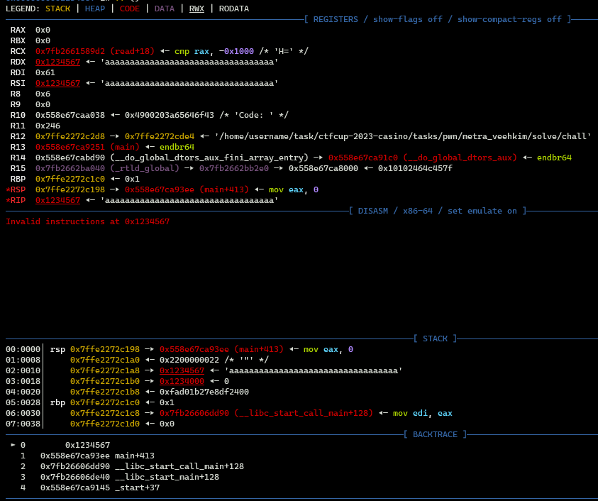

# pwn | Metra Veehkim

## Information

> Я слышал, что они на своей безлюдной планетке выдумали новый язык. Можешь попробовать в нем разобраться?
> 
> I have heard that they even came up with a new language on their lonely and deserted planet. Could you try figuring it out?
>
> `nc metra-veehkim-6d9d2149b126c2118a8bdd7e6f27cc32.ctfcup-2023.ru 13001`

## Deploy

```sh
cd deploy/
docker compose -p metra-veehkim up --build -d
```

## Public

Provide zip file [public/metra-veehkim.zip](./public/metra-veehkim.zip)

## TLDR

Отправить первый шеллкод, который вызовет `read` на область памяти с правами rwx, отправить второй шеллкод, который вызовет `execve("/bin/sh", 0, 0)`

## Writeup (ru)

Мы отправляем шеллкод, который может состоять только из символов из алфавита ` Metra_Veehkim`. Отправим `aaaaaaaaaaa` как шеллкод по адресу 0x1234567 и посмотрим на регистры и стек в момент начала выполнения шеллкода:

Видим, что для выполнения `read` практически все регистры стоят правильно: `rax = 0`, `rsi = rdx = shellcode_addr`. Не хватает только `rdi = 0` и инструкции `syscall`, которая равна 0f05, из-за чего мы не можем ее прямо передать в шеллкоде.

Можно быстро перебрать и посмотреть, какие инструкции мы можем выполнить ([i.txt](./solve/i.txt)). Из инструкций, пишущих в память, есть `and byte [rsi + 0x68], dl`. `rdx` и `rsi` - это адрес шеллкода, мы его контролируем, поэтому можно передать адрес, заканчивающийся на 0f, а в шеллкоде передать символы `_` (0x5f) и `e` (0x65). Тогда после выполнения `and` они станут равны 0f и 05, и мы получим инструкцию `syscall`. `rdi = 0` можно получить, выполнив несколько раз инструкцию `pop rdi`.

Вызвав `read`, отправим второй шеллкод, который выполнит `execve("/bin/sh", 0, 0)`.

[Exploit](./solve/sploit.py)

## Flag

```
ctfcup{1d4b352ee95939a4ff084d2ae52ed79a}
```

## Cloudflare

No
