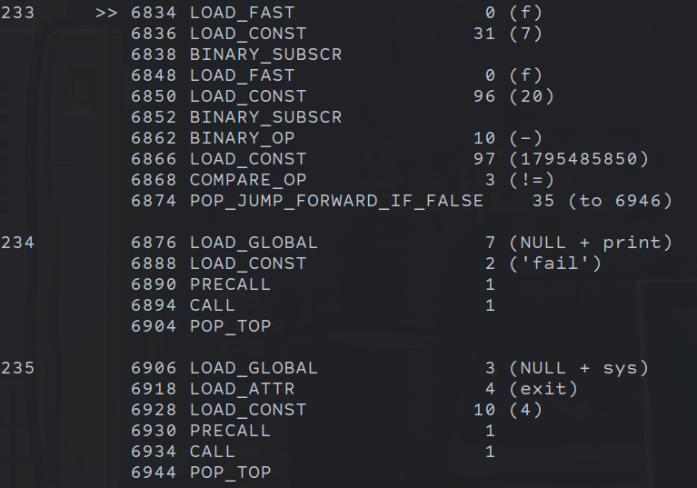

# rev | Embedded In Oil

## Information

Мы нашли этот странный артефакт в луже искусственной нефти.

We found this strange artifact embedded in artificial oil.

## Public

Provide executable: [public/embedded](public/embedded).

## TLDR

Some z3 invertable operations in a crackme in pyinstaller.

## Writeup (ru)

Нам дан исполняемый файл сделанный с помощью pyinstaller. В докере питона подходящей версии достанем оригинальный байткод с помощью [pyinstxtractor](https://github.com/extremecoders-re/pyinstxtractor), загрузим его с помощью `marshal.load` и диссасемблируем с помощью `dis.dis`. Исполняемый файл сначала считает функцию (`(binascii.crc32(c.encode("utf-8")) + 1337) ^ 31337` обернутое в 3 списковые сборки) над каждым символом ввода, затем проверяет полученный массив `f` рядом проверок. пример проверки: 

Эта проверка эквивалетна:
```python
if f[7] - f[20] != 1795485850:
    print("fail")
    sys.exit(4)
```


Достаточно сначала получить `f` с помощью sat солвера, затем перебрать каждый символ.

## Writeup (en)

We are given an executable file made with py installer. In a docker image with matching python version we can recover the original bytecode with [pyinstxtractor](https://github.com/extremecoders-re/pyinstxtractor), then load it with `marshal.load` and dissasemble with `dis.dis`. The executable first computes some function (`(binascii.crc32(c.encode("utf-8")) + 1337) ^ 31337` wrapped in 3 list comprehensions) over every characters of the first argument and then checks that the results array `f` matches some set of conditions. example of a condition: 

Which is equavalent to:
```python
if f[7] - f[20] != 1795485850:
    print("fail")
    sys.exit(4)
```

We can first obtain `f` by putting the conditions into a sat solver, than bruteforce each character.

[Exploit](solve/solve.py)

## Flag

ctfcup{b72d0648a6c58c28583901646c2b1e30}
