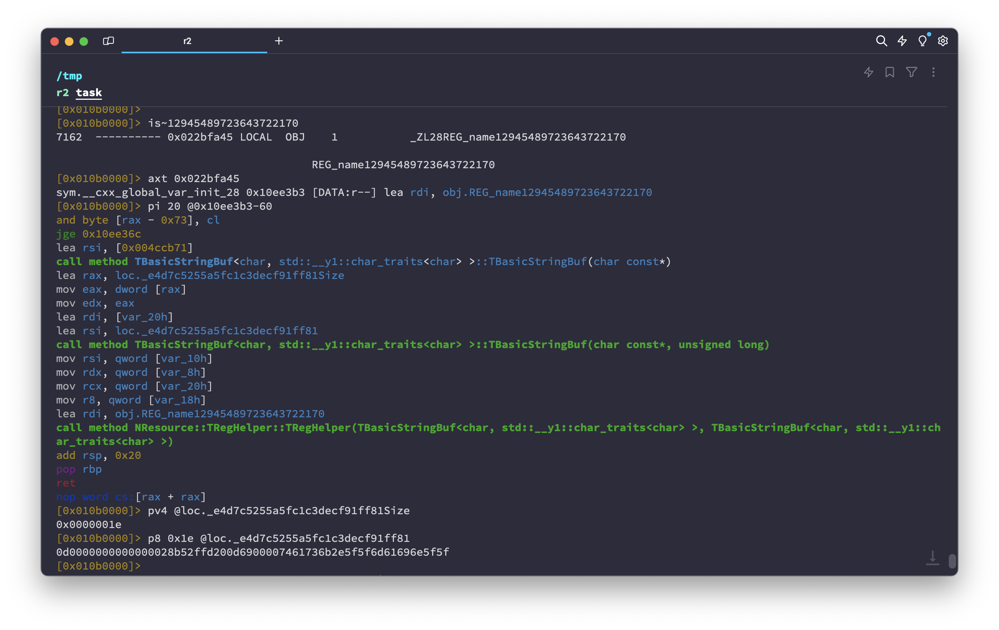
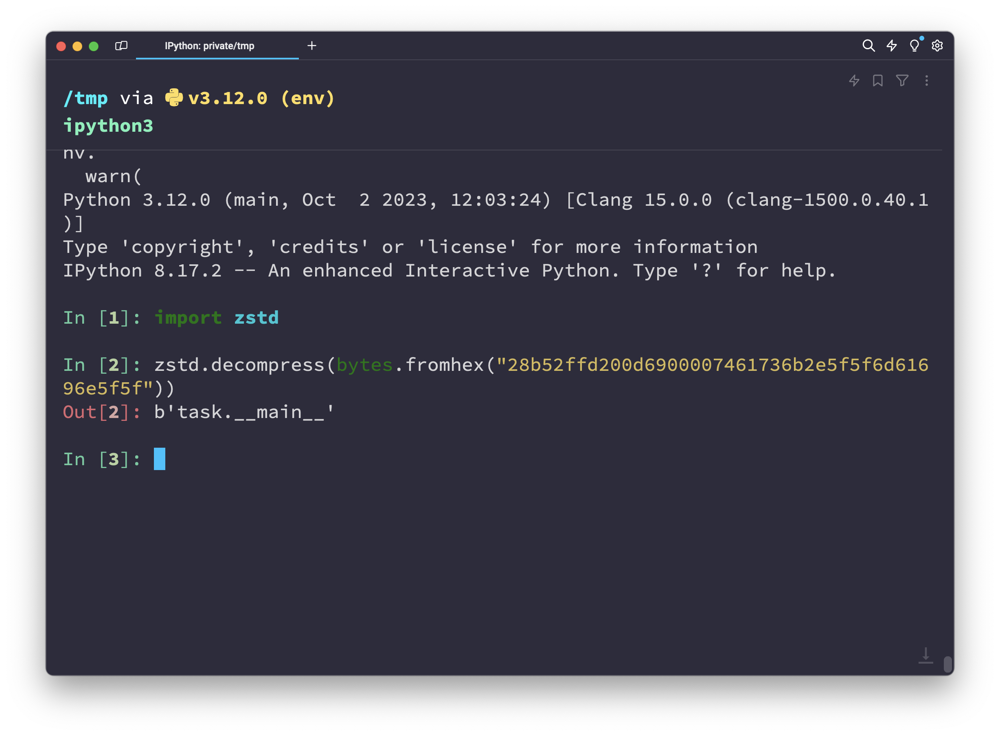

# rev | Enterprise Flagchecker

## Information

Мы, наконец-то, смогли разработать production-ready способ проверки флагов для нашей новой платформы для CTF.

We were finally able to develop a production-ready way to check flags for our new CTF platform.

## Public

Provide zip archive: [enterprise-flagchecker.zip](enterprise-flagchecker.zip).

## TLDR

Figure out how [yatool](https://github.com/yandex/yatool) bundles Python binaries and extract the original bundled source code.

## Writeup (ru)

В таске дан бинарник с довольно простым интерфейсом взаимодействия:

```bash
> ./task
Usage: ./task [flag]

> ./task ctfcup{bad-flag}
Nope
```

Если начать копаться в строках бинаря, что логично, т.к. весит он аж 74 мегабайта, и решить его просмотром в IDA или Ghidra будет невозможно, то нетрудно заметить упоминания некого `yatool`:


[yatool](https://github.com/yandex/yatool) - утилита для сборки приложений, используемая в Yandex. В репозитории можно много где найти упоминания сборки Python, которые помогают решить задание:
1. [py3cc](https://github.com/yandex/yatool/blob/main/tools/py3cc/main.py) - утилита для компиляции исходников Python в байткод и упаковки с помощью стандартной библиотеки `marshal`.
2. [compile_pysrc.py](https://github.com/yandex/yatool/blob/main/build/scripts/compile_pysrc.py) - скрипт для компиляции исходников Python и генерации C++ файла с ресурсами, содержащим весь упакованный байткод в виде так называемых "ресурсов".
3. [pybuild.py](https://github.com/yandex/yatool/blob/main/build/plugins/pybuild.py) - сам плагин для yatool, умеющий собирать сбандленные Python-приложения.

Собственно, последняя часть и является наиболее интересной, т.к. явно намекает на то, что эти ресурсы как-то можно достать из бинарника. Сама генерация C++ файла происходит с помощью другой утилиты, [rescompiler](https://github.com/yandex/yatool/blob/main/tools/rescompiler/main.cpp), которая просто добавляет все ресурсы как статические переменные, сжатые алгоритмом `zstd`, и названные конкретным форматом:

```cpp
const TString name = "name" + ToString(CityHash64(key.data(), key.size()));
```

Из плагина pybuild известно, что сам исполняемый файл Python также указывается как ресурс, причём с известным ключом - `PY_MAIN`. Таким образом, можно уже достать название исполняемого файла:

1. Считаем `CityHash64` от `PY_MAIN`. Пример программы для вычисления этого хеша приведён в [./solve/cityhash/city.cpp](./solve/cityhash/city.cpp): `12945489723643722170`.
2. Ищем символы с таким хешом, и xref'ы на них. xref'ы на эти ресурсы должны исходить из глобальной инициализации, `__cxx_global_var_init`.
3. В соответствии с тем, что написано в исходниках `rescompiler`, читаем адрес статической переменной и её длины.
4. Достаём сжатый ресурс, разжимаем его.

Вот пример, как проделать эти действия с `radare2`:





Зная название исполняемого файла, можно аналогичным образом достать ресурс исходника с названием `resfs/file/py/task/__main__.py` (`resfs/file/py` - префикс, генерируемый `compile_pysrc.py`), с хешом `12234563194863800747`:

```python
import zlib
import sys
import library.python.checker


def main():
    if len(sys.argv) < 2:
        print(f"Usage: {sys.argv[0]} [flag]")
        sys.exit(1)

    try:
        if library.python.checker.check(sys.argv[1]):
            print('Correct')
        else:
            print('Nope')
    except:
        sys.exit(1)


if __name__ == "__main__":
    main()
```

Ну, и, достать используемую библиотеку для проверки флага по пути `resfs/file/py/library/python/checker/__init__.py`, с хешом `17617334933283099896`:

```python
import base64
import zlib

CORRECT = [101, 74, 120, 76, 76, 107, 108, 76, 76, 105, 50, 111, 84, 103, 114, 78, 83, 122, 70, 77, 100, 89, 107, 118, 113, 65, 122, 74, 77, 77, 106, 84, 68, 85, 111, 78, 48, 48, 48, 114, 77, 115, 106, 86, 78, 83, 104, 73, 57, 84, 80, 78, 76, 121, 49, 121, 84, 113, 48, 70, 65, 69, 121, 71, 68, 120, 73, 61]

def check(flag: str) -> bool:
    for i in range(10):
        ours = zlib.compress(flag.encode())
        for _ in range(10):
            b = base64.b64encode(ours)
            for i, c in enumerate(b):
                if CORRECT[i] ** 1000 != c ** 1000:
                    return False
    return True
```

Ну а решение этого чекера можно оставить в качестве упражнения читателю.

## Writeup (en)

TODO

## Flag

`ctfcup{bUnd1eD_pyTh0n-ReV-fr0m-0peN5ourCe}`
