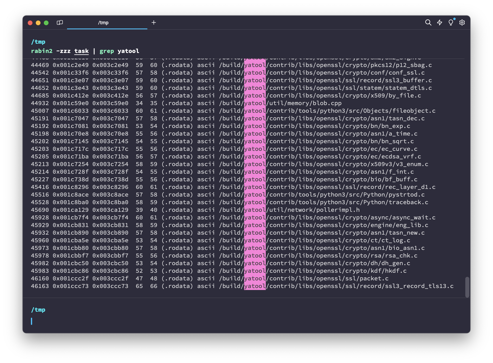

# rev | Enterprise Flagchecker

## Information

Мы, наконец-то, смогли разработать production-ready способ проверки флагов для нашей новой платформы для CTF.

We were finally able to develop a production-ready way to check flags for our new CTF platform.

## Public

Provide zip archive: [enterprise-flagchecker.zip](enterprise-flagchecker.zip).

## TLDR

Figure out how [yatool](https://github.com/yandex/yatool) bundles Python binaries and extract the original bundled source code.

## Writeup (ru)

В таске дан бинарник с довольно простым интерфейсом взаимодействия:

```bash
> ./task
Usage: ./task [flag]

> ./task ctfcup{bad-flag}
Nope
```

Если начать копаться в строках бинаря, что логично, т.к. весит он аж 74 мегабайта, и решить его просмотром в IDA или Ghidra будет невозможно, то нетрудно заметить упоминания некого `yatool`:



[yatool](https://github.com/yandex/yatool) - утилита для сборки приложений, используемая в Yandex. В репозитории можно много где найти упоминания сборки Python, которые помогают решить задание:
1. [py3cc](https://github.com/yandex/yatool/blob/main/tools/py3cc/main.py) - утилита для компиляции исходников Python в байткод и упаковки с помощью стандартной библиотеки `marshal`.
2. [compile_pysrc.py](https://github.com/yandex/yatool/blob/main/build/scripts/compile_pysrc.py) - скрипт для компиляции исходников Python и генерации C++ файла с ресурсами, содержащим весь упакованный байткод в виде так называемых "ресурсов".

Собственно, последняя часть и является наиболее интересной, т.к. явно намекает на то, что эти ресурсы как-то можно достать из бинарника. Сама генерация C++ файла происходит с помощью другой утилиты, [rescompiler](https://github.com/yandex/yatool/blob/main/tools/rescompiler/main.cpp), которая просто

## Writeup (en)

TODO

## Flag

`ctfcup{bUnd1eD_pyTh0n-ReV-fr0m-0peN5ourCe}`
